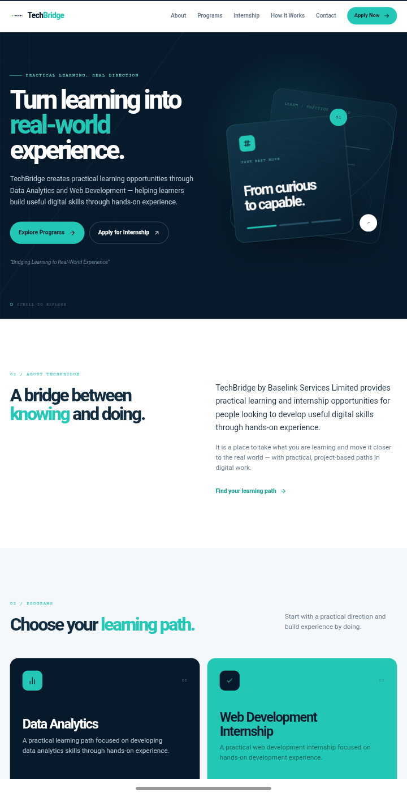
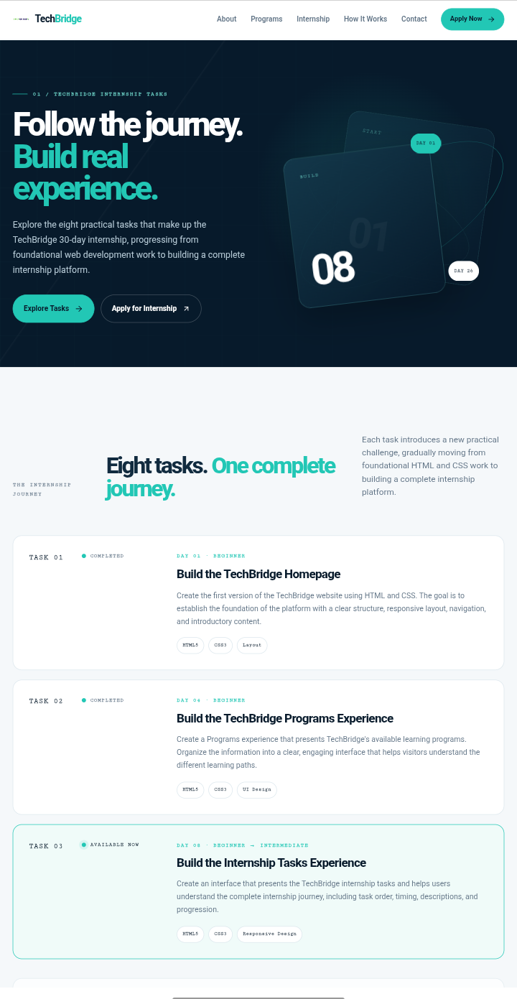

# TechBridge

TechBridge is a modern landing page for a practical technology learning and internship platform focused on helping beginners gain real-world experience through hands-on learning.

## ✨ Features

- Responsive modern design
- Mobile navigation
- Programs and internship sections
- How It Works section
- Application CTA
- Contact section
- Scroll-reveal animations
- Accessible navigation and buttons
- TechBridge brand identity and logo

## 🛠️ Built With

- HTML5
- CSS3
- JavaScript
- Lucide Icons

## 🎯 Purpose
Built to present TechBridge's practical learning and internship opportunities through a clean, professional, and responsive web experience.

## Task 4 — Interactive Internship Roadmap

An interactive 30-day internship roadmap for the TechBridge Data Analytics and Web Development tracks.

Features

- Switch between both internship tracks without page refresh.
- Displays all 8 tasks with day, description, and difficulty.
- Responsive roadmap layout for desktop, tablet, and mobile.
- Built with HTML5, CSS3, and JavaScript.

## Screenshots

### Desktop

### Mobile

### Roadmaps 

### Developer Note
I presented the eight tasks as a simple vertical journey to make the 30-day progression easy to follow. I chose this layout for clarity and consistency with the existing TechBridge platform. I learned more about structuring responsive experiences with HTML5 and CSS3. The main challenge was maintaining consistency across different screen sizes.

##### Roadmap
I built the roadmap to make the 30-day internship journey easy to follow. JavaScript lets users switch between the two tracks without refreshing the page. I used arrays, objects, functions, events, and DOM manipulation. I also made the layout responsive for different screen sizes. This task helped me get more comfortable building interactive interfaces with JavaScript.