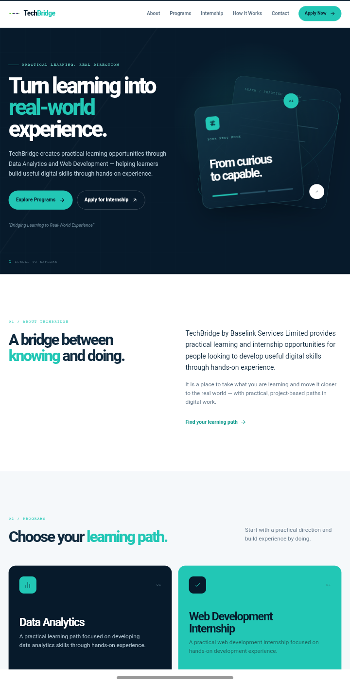
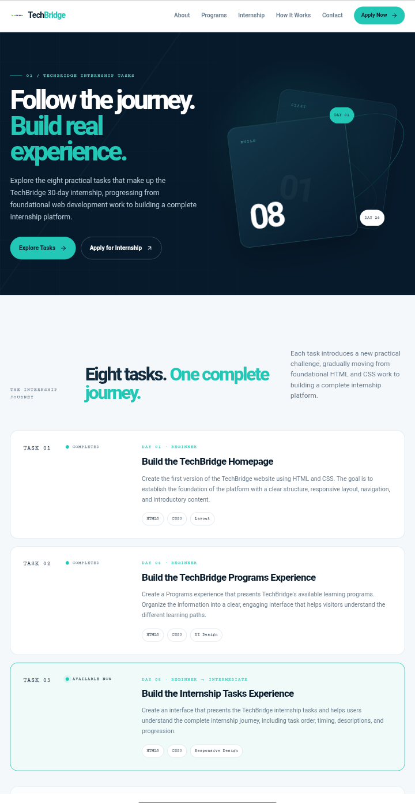
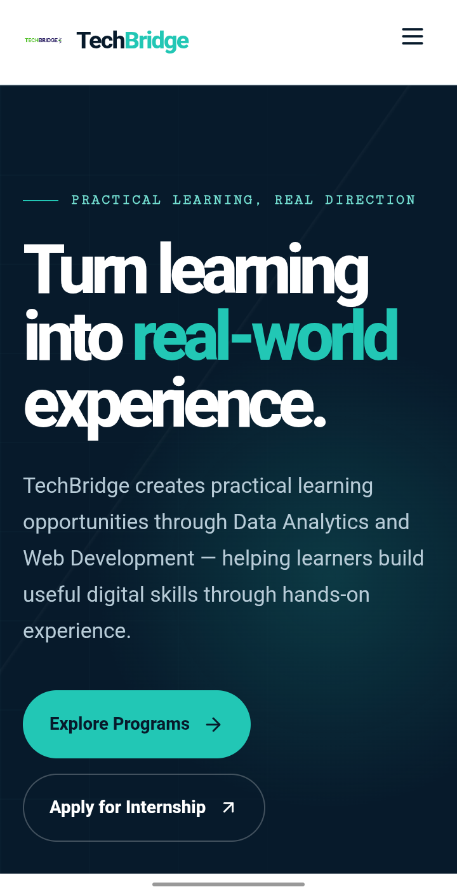
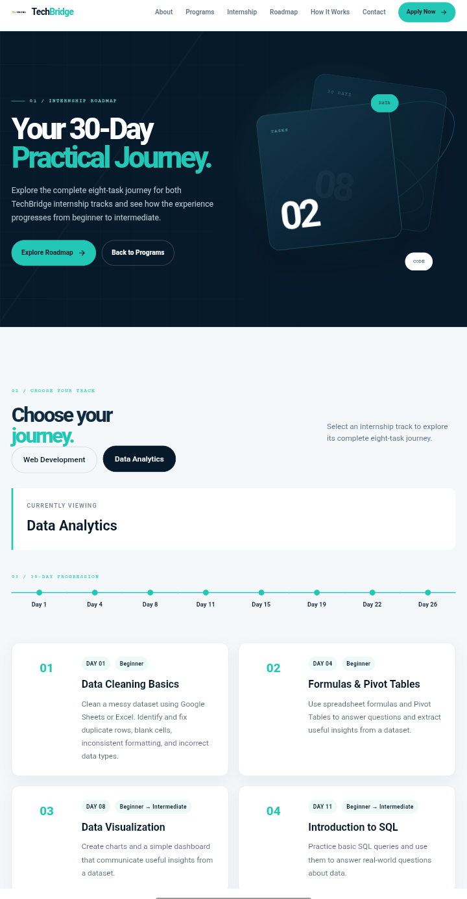
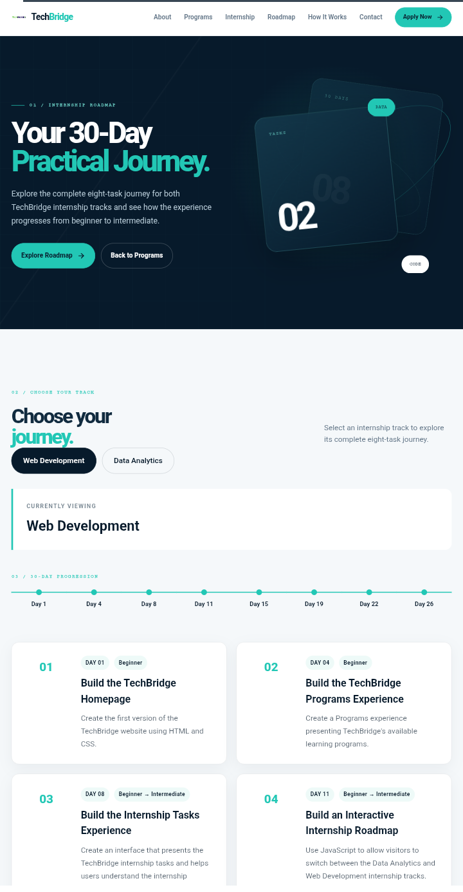
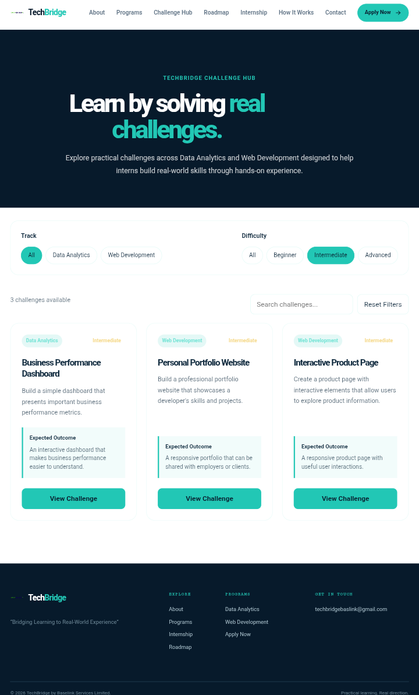
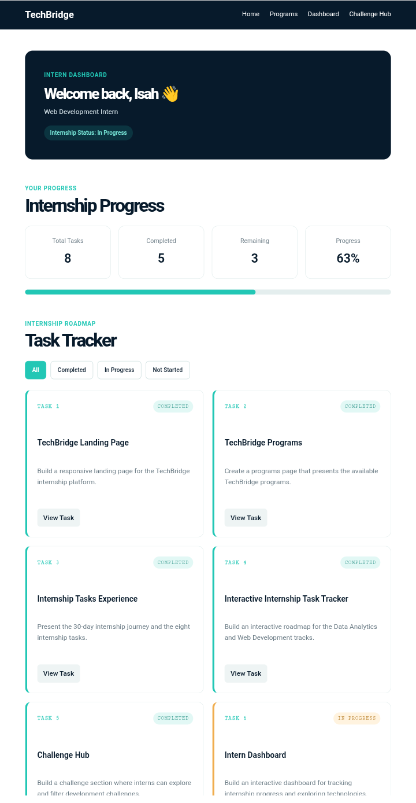

# TechBridge Intern Management Platform

TechBridge is a practical learning and internship platform that helps beginners build real-world digital skills through hands-on projects, challenges, and internship tasks.

## 🚀 Features

- Responsive TechBridge landing page
- Intern Dashboard
- Dynamic task management
- Task search and status filtering
- Task status updates through REST API
- Dynamic progress tracking
- View task details without page refresh
- Challenge Hub with search and filtering
- Data Analytics and Web Development challenges
- Interactive internship roadmaps
- Loading and error states
- Responsive desktop, tablet, and mobile design
- Professional and accessible UI

## 🛠️ Built With

- HTML5
- CSS3
- JavaScript
- Node.js
- Express.js
- REST API
- JSON
- Lucide Icons

## 📁 Project Structure

techbridge/
├── frontend/
│   ├── index.html
│   ├── dashboard.html
│   ├── challenges.html
│   ├── programs.html
│   ├── css/
│   │   └── style.css
│   ├── js/
│   │   ├── dashboard.js
│   │   └── script.js
│   ├── images/
│   └── tasks/
├── backend/
│   ├── server.js
│   └── data/
│       └── tasks.json
├── screenshots/
└── README.md

## 🔗 API

Base URL: https://techbridge-task-api.onrender.com

### Endpoints

GET  /api/tasks
GET  /api/tasks/:id
PUT  /api/tasks/:id

The dashboard fetches internship tasks from the Express API instead of using hardcoded task data.

### ▶️ Run Locally

Frontend

Open the "frontend" folder with Live Server.

Backend

cd backend
npm install
node server.js

The API runs on:

http://localhost:3000

📸 ## Screenshots

### Desktop

### Mobile

### Roadmaps 

### Challenge Hub 

### Dashboard 

### 🧠 What I Learned

This project helped me strengthen my understanding of:

- JavaScript DOM manipulation
- API integration
- Asynchronous JavaScript and "fetch()"
- REST API development with Express.js
- Dynamic task rendering
- Search and filtering
- Frontend-backend communication
- Responsive web design
- Loading and error handling
- Building and integrating multiple project features

### 🎯 Final Project

Task 8 brings the previous TechBridge internship tasks together into one complete Intern Management Platform, combining the landing page, Challenge Hub, internship dashboard, task management API, interactive features, and responsive design.

## 👨‍💻 Developer (Isah Muhammad)

Built as part of the TechBridge Web Development Internship Program.
